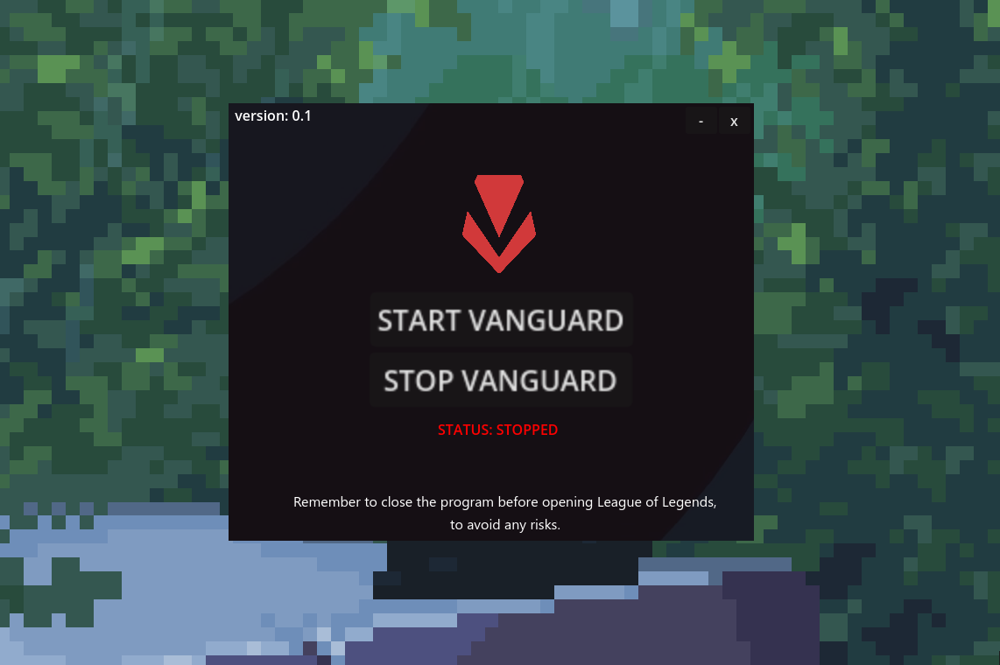
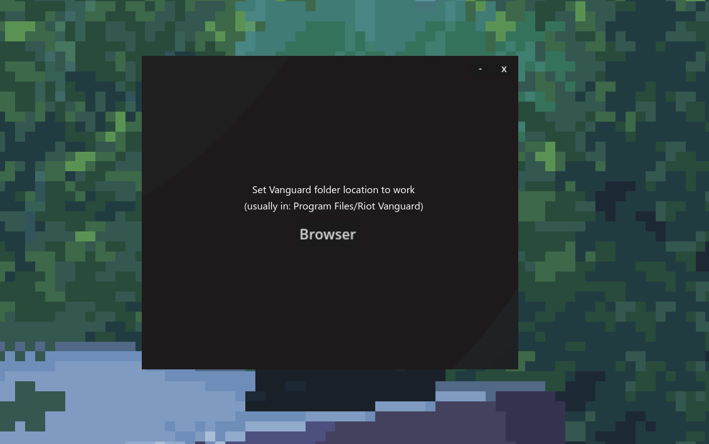
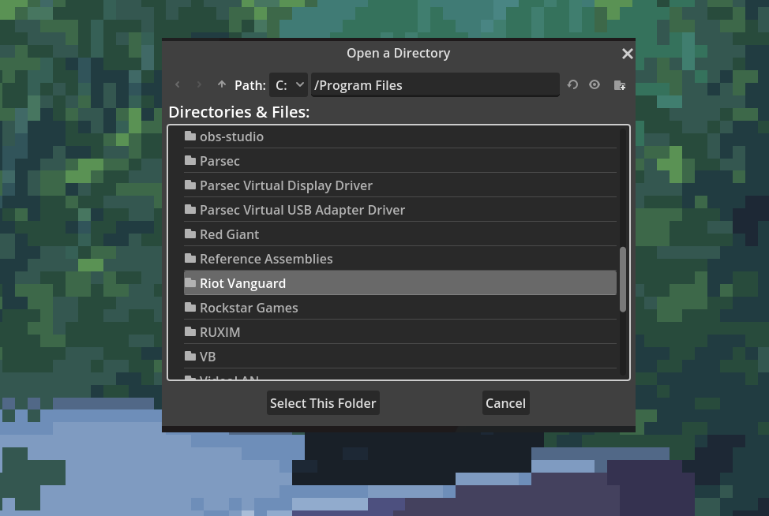

# VanguardAuto

Hey there! I was getting really fed up with the idea of being constantly monitored while using Riot Vanguard, especially with all the concerns about data going to who knows where. So, I made **VanguardAuto**. It’s a simple tool that gives you control over Vanguard, letting you turn it on or off whenever you want, without needing to reboot your PC or deal with any of that command prompt nonsense.

--------------------------------------------------------------------------------------------------

Here’s a quick tutorial: Select the location of your Vanguard, which is usually in the default folder *'Program Files/Riot Vanguard'*. (I did this to avoid future errors in case Vanguard is installed on a different drive).

--------------------------------------------------------------------------------------------------

I recommend keeping the Vanguard system tray icon pinned to the taskbar so you can easily see whether it's open or closed.

--------------------------------------------------------------------------------------------------

And don't forget to close VanguardAuto before opening any game! It runs real-time commands to check Vanguard's status, and the game might not like that. But if you close VanguardAuto before starting the game, everything will run smoothly without any issues.

So make sure to close it!